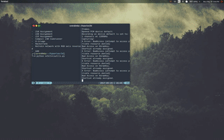

# Python Satellite Toolkit

This is just a fun project I made over summer. Simulates and visualize a satellite with an unperturbed elliptic orbit around the earth, using vpython-wx and numpy.

Also simulates things like battery, communication with earth, etc.
